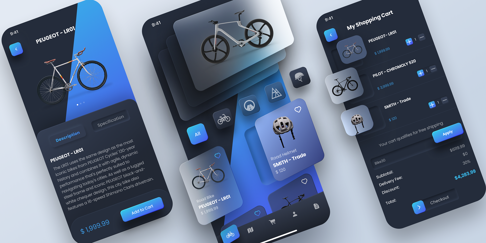

# 🚴‍♂️ online\_bike\_shopping

**online\_bike\_shopping** is a Flutter application for buying and selling bicycle parts and accessories. It features a beautiful, custom-designed UI with many unique shapes and layouts, creating a modern shopping experience.



---

## ✨ Features

* 🏠 **Home Page** – Browse bicycle parts, view categories, and use filters
* 📄 **Detail Page** – See product details, specifications, and multiple images
* 🛒 **Basket Page** – Add, remove, and manage items in the shopping cart with real-time price updates

---

## 🏗 Architecture

This project follows **Clean Architecture** principles and uses **Riverpod** for state management.

```
lib/
├── features/
│   ├── home/
│   │   ├── view/         # HomePage widgets
│   │   ├── controller/   # Riverpod providers & state logic
│   │   └── widgets/      # Reusable widgets
│   ├── detail/
│   │   ├── view/
│   │   ├── controller/
│   │   └── widgets/
│   └── basket/
│       ├── view/
│       ├── controller/
│       └── widgets/
├── core/
│   ├── theme/            # App colors, typography, shapes
│   ├── utils/            # Helpers & constants
│   └── network/          # API services
└── main.dart
```

---

## 🧩 State Management

* **Riverpod** is used to manage state across pages.
* Providers are organized by feature, making it easy to scale and maintain.

Example:

```dart
final basketProvider = StateNotifierProvider<BasketController, List<Product>>((ref) {
  return BasketController();
});
```

---

## 🚀 Getting Started

### 1. Clone the repository:

```bash
git clone https://github.com/your-username/online_bike_shopping.git
cd online_bike_shopping
```

### 2. Install dependencies:

```bash
flutter pub get
```

### 3. Run the app:

```bash
flutter run
```

---

## 📄 License

This project is open-source and available under the [MIT License](LICENSE).
